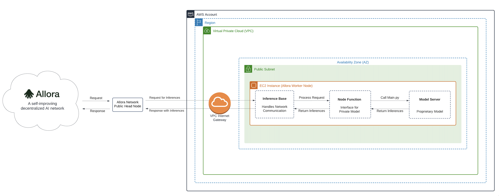

# Sample AWS Blockchain Node Runner app for Allora Worker Nodes

| Contributed by |
|:--------------------:|
| [@vladupshot](https://github.com/vladupshot), [@allora-rc](https://github.com/allora-rc) |

[Allora](https://www.allora.network/) is a self-improving decentralized Artificial Intelligence (AI) network. The primary goal of the network is to be the marketplace for intelligence. In other words, Allora aims to incentivize data scientists (workers) to provide high-quality inferences as requested by consumers. Inferences include predictions of arbitrary future events or difficult computations requiring specialized knowledge.

The Allora Network brings together

  - [Consumers](https://docs.allora.network/devs) who pay for and acquire inferences or expertise to be revealed
  - [Workers](https://v2.docs.allora.network/datasci) who reveal inferences
  - [Reputers](https://docs.allora.network/nops) who determine how accurate workers are after a ground truth is revealed
  - [Validators](https://docs.allora.network/nops) who secure protocol state, history, and reward distributions

With these ingredients, the Allora Network is able to continuously learn and improve itself over time producing inferences that are more accurate than the most accurate participant.

Allora Worker nodes are the interfaces between data scientists' models and the Allora Network. A worker node is a machine-intelligent application registered on the Allora chain that provides inference/prediction on a particular topic it's subscribed to and gets rewarded based on the inference quality.

This blueprint is designed to assist in deploying a single Allora [Worker Node](https://v2.docs.allora.network/datasci) on AWS. It is intended for use in development, testing, or Proof of Concept (PoC) purposes.

## Overview of Deployment Architecture

### Single Worker Node Setup

## Additional materials

Well-Architected Checklist

This is the Well-Architected checklist for Allora Worker Nodes implementation of the AWS Blockchain Node Runner app. This checklist takes into account questions from the [AWS Well-Architected Framework](https://aws.amazon.com/architecture/well-architected/) which are relevant to this workload. Please feel free to add more checks from the framework if required for your workload.

| Pillar                  | Control                           | Question/Check                                                                   | Remarks |
|:------------------------|:----------------------------------|:---------------------------------------------------------------------------------|:----------------------------------------------------------------------------------------------------------------------------------------------------------------------------------------------------------------------------------------------------------------------------------------------------------------------------------------------------------------------------------------------|
| Security                | Network protection                | Are there unnecessary open ports in security groups?                             | Please note that ports 5050 (TCP/UDP) for Fantom are open to public to support P2P protocols. |
|                         |                                   | Traffic inspection                                                               | Traffic protection is not used in the solution. [AWS Web Applications Firewall (WAF)](https://docs.aws.amazon.com/waf/latest/developerguide/waf-chapter.html) could be implemented for traffic over HTTP(S), [AWS Shield](https://docs.aws.amazon.com/waf/latest/developerguide/shield-chapter.html) provides Distributed Denial of Service (DDoS) protection. Additional charges will apply. |
|                         | Compute protection                | Reduce attack surface                                                            | This solution uses Ubuntu 22.04 AMI(`Ubuntu 22.04.4`). You may choose to run hardening scripts on it. |
|                         |                                   | Enable people to perform actions at a distance                                   | This solution uses [AWS Systems Manager for terminal session](https://docs.aws.amazon.com/systems-manager/latest/userguide/session-manager-working-with-sessions-start.html#start-sys-console), not ssh ports. |
|                         | Data protection at rest           | Use encrypted Amazon Elastic Block Store (Amazon EBS) volumes                    | This solution uses encrypted Amazon EBS volumes. |
|                         | Data protection in transit        | Use TLS                                                                          | The AWS Application Load balancer currently uses HTTP listener. Create HTTPS listener with self signed certificate if TLS is desired. |
|                         | Authorization and access control  | Use instance profile with Amazon Elastic Compute Cloud (Amazon EC2) instances    | This solution uses AWS Identity and Access Management (AWS IAM) role instead of IAM user. |
|                         |                                   | Following principle of least privilege access                                    | In all node types, root user is not used (using special user "bcuser" instead). |
|                         | Application security              | Security focused development practices                                           | cdk-nag is being used with appropriate suppressions. |
| Cost optimization       | Service selection                 | Use cost effective resources                                                     | 1/ We use x86-based binaries. We recommend using the `m6a.2xlarge` EC2 instance type to optimize computational costs.  2/ Cost-effective EBS gp3 are used instead of io2. |
|                         | Cost awareness                    | Estimate costs                                                                   | Single RPC node with `m6a.2xlarge` EBS gp3 volumes about 4000 GB(1000 IOPS, 700 MBps/s throughput) with On-Demand pricing will cost around US$854.54 per month in the US East (N. Virginia) region. More cost-optimal option with 3 year EC2 Instance Savings plan the cost goes down to $594.15 USD. To create your own estimate use [AWS Pricing Calculator](https://calculator.aws/#/)                                                                                          |
| Reliability             | Resiliency implementation         | Withstand component failures                                                     | This solution uses AWS Application Load Balancer with RPC nodes for high availability. Newly provisioned Fantom nodes triggered by Auto Scaling get up and running in about 300 minutes.  |
|                         | Data backup                       | How is data backed up?                                                           | Considering blockchain data is replicated by nodes automatically and Fantom nodes sync from start within an hour, we don't use any additional mechanisms to backup the data. |
|                         | Resource monitoring               | How are workload resources monitored?                                            | Resources are being monitored using Amazon CloudWatch dashboards. Amazon CloudWatch custom metrics are being pushed via CloudWatch Agent.  |
| Performance efficiency  | Compute selection                 | How is compute solution selected?                                                | Compute solution is selected based on best price-performance, i.e. AWS Graviton-based Amazon EC2 instances. |
|                         | Storage selection                 | How is storage solution selected?                                                | Storage solution is selected based on best price-performance, i.e. gp3 Amazon EBS volumes with optimal IOPS and throughput. |
|                         | Architecture selection            | How is the best performance architecture selected?                               | We used a combination of recommendations from the Fantom community and our own testing. |
| Operational excellence  | Workload health                   | How is health of workload determined?                                            | Health of workload is determined via AWS Application Load Balancer Target Group Health Checks, on port 8845. |
| Sustainability          | Hardware & services               | Select most efficient hardware for your workload                                 | The solution uses Graviton-powered instances. There is a potential to use AWS Graviton-based Amazon EC2 instances which offer the best performance per watt of energy use in Amazon EC2. |

Recommended Infrastructure

| Usage pattern                                     | Ideal configuration                                                                                                      | Primary option on AWS                                                  | Config reference                                      |
|---------------------------------------------------|--------------------------------------------------------------------------------------------------------------------------|------------------------------------------------------------------------|-------------------------------------------------------|
| 1/ Fullnode                                       | 8 vCPU, 32 GB RAM, Data volume: EBS gp3 2TB, 7K IOPS, 400 MB/s throughput | `m6a.2xlarge` EBS gp3 volumes about 2000 GB(7000 IOPS, 400 MBps/s throughput) | [.env-sample-full](./sample-configs/.env-sample-full) |

